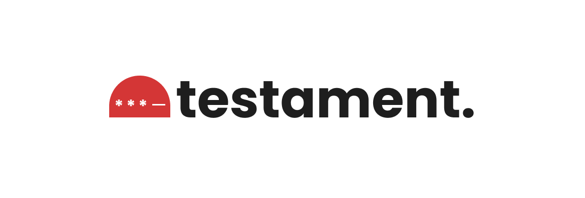

<p align="center">
    
    <p align="center">
        <a href="https://github.com/codelabmw/testament/actions"></a>
        <a href="https://packagist.org/packages/codelabmw/testament"></a>
        <a href="https://packagist.org/packages/codelabmw/testament"></a>
        <a href="https://packagist.org/packages/codelabmw/testament"></a>
    </p>
</p>

------
A UI & DB agnostic PHP package for code generation and verification. It only aims on providing an API for generating cryptographic codes and verifying between two given codes elegantly.

> **Requires [PHP 8.3+](https://php.net/releases/)**

## Installation

You can install the package via composer:

```bash
composer require codelabmw/testament
```

## Usage

```php
<?php

$testament = new \Codelabmw\Testament\Testament::default();

$code = $testament->generate(
  type: \Codelabmw\Testament\Enums\CodeType::NUMERIC /* code type - numeric | alpa | alphanumeric | password */,
  length: 8 /* number of characters */
);

$codeFromUser = getUserCode();
$codeFromStorage = getStorageCode();

$verified = $testament->verify(
  expected: $codeFromUser /* ... */,
  actual: $codeFromStorage /* ... */,
);
```

## Testing

```bash
composer test
```

## Changelog

Please see [CHANGELOG](CHANGELOG.md) for more information on what has changed recently.

## Contributing

Please see [CONTRIBUTING](CONTRIBUTING.md) for details.

## Credits

- [Chikondi Kamwendo](https://github.com/kondi3)
- [All Contributors](../../contributors)

## License

The MIT License (MIT). Please see [License File](LICENSE.md) for more information.
